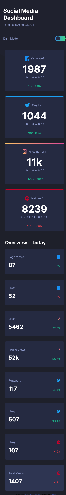

# Frontend Mentor - Social media dashboard with theme switcher solution

This is a solution to the [Social media dashboard with theme switcher challenge on Frontend Mentor](https://www.frontendmentor.io/challenges/social-media-dashboard-with-theme-switcher-6oY8ozp_H). Frontend Mentor challenges help you improve your coding skills by building realistic projects.

## Table of contents

- [Overview](#overview)
  - [The challenge](#the-challenge)
  - [Screenshot](#screenshot)
  - [Links](#links)
- [My process](#my-process)
  - [Built with](#built-with)
  - [What I learned](#what-i-learned)
  - [Continued development](#continued-development)
  - [Useful resources](#useful-resources)
- [Author](#author)


## Overview

### The challenge

Users should be able to:

- View the optimal layout for the site depending on their device's screen size
- See hover states for all interactive elements on the page
- Toggle color theme to their preference

### Screenshot



### Links

- Solution URL: [Add solution URL here](https://github.com/vikiorf/social-media-dashboard)
- Live Site URL: [Add live site URL here](https://social-media-dashboard-six-delta.vercel.app/)

## My process

### Built with

- Semantic HTML5 markup
- CSS custom properties
- Flexbox
- CSS Grid
- Mobile-first workflow

### What I learned

I learned about ::before and ::after while doing this project. They are really fun to work with!
I also learned along the way that I should have one class for the heading-color and one class for the text-color making the theme switch much easier.

```css
#header::after {
  content: '';
  background-color: inherit;
  display: block;
  position: absolute;
  z-index: -1;
  bottom: -10;
  left: 0;
  height: 70px;
  width: 100%;
  border-bottom-left-radius: 20px;
  border-bottom-right-radius: 20px;
}
```

### Continued development

I need to plan out my time better. For this project I expected 1 hour worktime when in reality it became 4 hours.
If I plan out the application from the beginning instead of just starting I think it would take less time

### Useful resources

- [::before and ::after css](https://www.youtube.com/watch?v=zGiirUiWslI) - This video really helped me understand the basics of ::before and ::after. Would really recommend for anyone who don't understand those concepts.

## Author

- Frontend Mentor - [@vikiorf](https://www.frontendmentor.io/profile/vikiorf)
